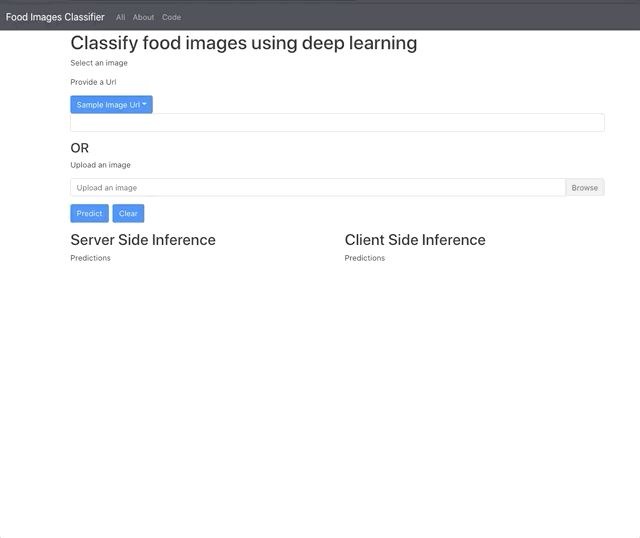

# Deploying Web App

## Overview

This repo is a web app that supports server-side and browser-based inference, deployed on a cloud provider Heroku.

In [backend](backend), is the server side inference code written in Python and served with FastApi.
In [frontend](frontend), is the browser based inference code written in Typescript/React

## Demo

Server Side Inference : [Heroku](https://food101-app.herokuapp.com/deploying-web-app/)
Browse Based Inference: [Github Pages](https://github.com/elliemci/deploying-web-app)





## Setup


## Converting TensorFlow model

It is strongly recommended to create a separate environment for `tesnorflowjs`

Installing tensorflowjs
```
pip install tensorflowjs==2.3.0
```

Converting keras model located at `artifacts/model_tf_keras.h5` and saving to `artifacts/model_tfjs`

The `quantize_float16=*`  decrease the default 32-bit precision to 16-bit precision which will reduce the model file size by half

```
tensorflowjs_converter \
--input_format=keras \
--output_format=tfjs_graph_model \
--split_weights_by_layer \
--weight_shard_size_bytes=99999999 \
--quantize_float16=* \
artifacts/model_tf_keras.h5 artifacts/model_tfjs

```


## Local Deployment

```
docker build -t app .
docker run -p 8000:8000 -t app
```

When developed outside Docker, python - backend

```
conda create -n dl_env python=3.8
pip install -r backend/requirements.txt
```

frontend
```
yarn
```


## Server Deployment

This app is deployed at Heroku.
Here are the steps for mac

Setup
```
brew tap heroku/brew && brew install heroku
heroku login
heroku container:login
```

`APP_NAME` is something unique
```


APP_NAME="food101-deploy"
heroku create $APP_NAME

heroku container:push web --app ${APP_NAME}

heroku container:release web --app ${APP_NAME}
heroku open --app $APP_NAME
heroku logs --tail --app ${APP_NAME}
```

## Customizing
Most of the text and options are configured in this [config.yml](config.yaml).
