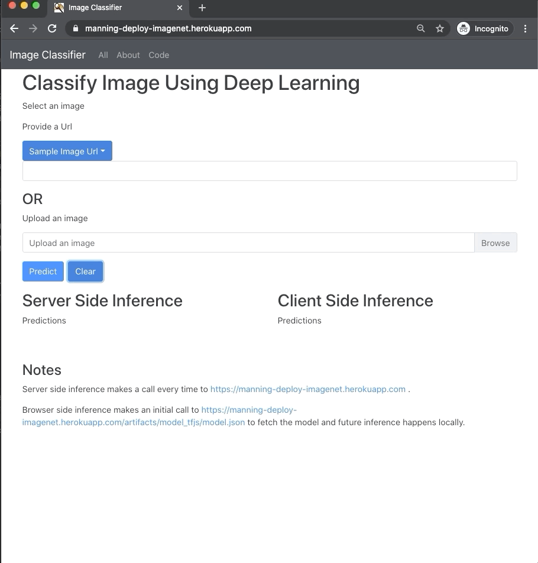

# Deploying Web App

## Overview

This repo is a web app that supports server-side inference, deployed on a cloud provider Heroku and and browser-based inference that run on localhost with Docker.

In [backend](backend), is the server side inference code written in Python and served with FastApi.
In [frontend](frontend), is the browser based inference code written in Typescript/React

### Server Side Inference:
[Heroku](https://food101-classifier.herokuapp.com)

### Browse Based Inference:
[Github Pages](https://github.com/elliemci/deploying-web-app)

## Demo


## Converting TensorFlow model

It is strongly recommended to create a separate environment for `tesnorflowjs`

Installing tensorflowjs
```
pip install tensorflowjs==2.3.0
```

Converting keras model located at `artifacts/model_tf_keras.h5` and saving to `artifacts/model_tfjs`

The `quantize_float16=*`  decrease the default 32-bit precision to 16-bit precision which will reduce the model file size by half

```
tensorflowjs_converter \
--input_format=keras \
--output_format=tfjs_graph_model \
--split_weights_by_layer \
--weight_shard_size_bytes=99999999 \
--quantize_float16=* \
artifacts/model_tf_keras.h5 artifacts/model_tfjs

```
### Backend

app.py: This contains the FastAPI web routes that expose the prediction endpoint and serve the static files.

helper.py: This loads the model.h5 file, performs the inference, and returns the prediction

### Frontend

The React frontend app is composed of two main screens: Home and About.

The core inferencing logic is defined in the typescript file written with jsx (JavaScript XML) ModelService.tsx; the class contains both server-side inference and browser-based inference code.

The code that makes a call to the FastAPI backend for server-side inference:

```
// Load the image.

const imgUrl = ...
const response = await fetch(imgUrl);
const data = await response.blob();

// Prepare the image for post endpoint.
const metadata = {
                type: 'image/jpeg'
            };

const imageData = new File([data], 'upload.jpeg', metadata)
const data = new FormData();
data.append('file', args.imageData);

// Make a call to the backend.
const resPromise = await axios.post'/api/predict_image', data);

```

The code used for Browser side Inference:

```
const element: HTMLImageElement = ...;

let imageTensor = tf.browser.fromPixels(element)
    .resizeBilinear([this.image_size, this.image_size])
    .toFloat();

// Normalize the image from [0, 255] to [-1, 1].
const offset = tf.scalar(127.5);
const normalized = imageTensor.sub(offset).div(offset);

// Reshape to a single-element batch so we can pass it to predict.
const batched = normalized.reshape([1, this.image_size, this.image_size, 3]);

// Make a prediction through mobilenet.
mobilenet.predict(batched);

```

## Local Deployment

```
docker build -t app .
docker run -p 8000:8000 -t app
```

When developed outside Docker, python - backend

```
conda create -n dl_env python=3.8
pip install -r backend/requirements.txt
```

frontend
```
yarn
```

## Server Deployment

This app is deployed at Heroku.
Here are the steps for mac

Setup
```
brew tap heroku/brew && brew install heroku
heroku login
heroku container:login
```

`APP_NAME` is something unique
```


APP_NAME="food101-classifier"
heroku create $APP_NAME

heroku container:push web --app ${APP_NAME}

heroku container:release web --app ${APP_NAME}
heroku open --app $APP_NAME
heroku logs --tail --app ${APP_NAME}
```

## Customizing
Most of the text and options are configured in this [config.yml](config.yaml).
